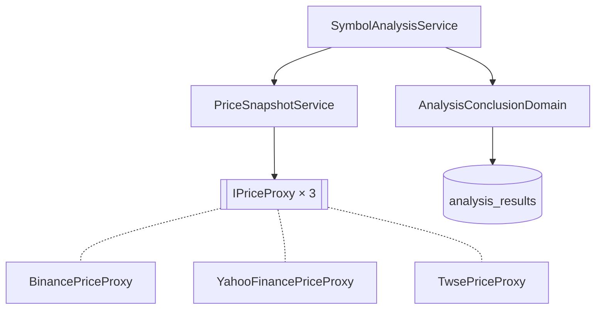

# 分析時價格 — Architecture Design

**Status:** Confirmed
**Source PRD:** `.sdd/2026-10-06-analysis-price-snapshot/PRD.md`
**Tech context:** Go · GORM（PostgreSQL `numeric`）· `shopspring/decimal` · Clean / Onion Architecture

---

## 1. Design Goal & Guiding Principle

- **In one sentence:** AI 結論通過正規化後，`PriceSnapshotService` 依市場類別向對應的 `IPriceProxy` 取得報價（失敗則為未取得），與分析結果一起保存並於查詢時回傳。
- **Guiding principle:** **「取得分析時價格」是一個獨立、永不失敗的 domain 能力。** `PriceSnapshotService.CapturePrice` 只回傳「報價或未取得」，分析流程不需要知道任何價格來源的錯誤。下一個切片（回測）要取「某時點之後的價格」時，重用同一組 `IPriceProxy` 與 `PriceQuoteVo`。

---

## 2. Change Scope

| Area | Action | What / Why |
| :--- | :--- | :--- |
| `internal/domain/` | **Add** | `PriceQuoteVo`、`IPriceProxy`、`PriceProviderCatalogDto`、`CapturePriceDto`、`PriceAtAnalysisDto`、`PriceSnapshotService` |
| `AnalysisResult` entity | **Modify** | 新增 `Price`（`decimal.NullDecimal`，`numeric`）、`PriceCurrency`、`PricedAt`、`PriceSource` |
| `AnalysisConclusionDomain.ToResultEntity` | **Modify** | 多收一個 `*vo.PriceQuoteVo` |
| `AnalysisEventDomain.ToDto` / `AnalysisResultDto` | **Modify** | 回傳 `priceAtAnalysis`（未取得為 `null`，欄位一律出現） |
| `SymbolAnalysisService.AnalyzeSymbol` | **Modify** | 結論通過後呼叫 `PriceSnapshotService.CapturePrice` |
| `internal/infrastructure/` | **Add** | `BinancePriceProxy`（`binance/`）、`YahooFinancePriceProxy`（`yahoofinance/`）、`TwsePriceProxy`（`twse/`） |
| `cmd/server/` | **Modify** | 價格來源網址與目錄組裝 |
| 回測 | **Not touched** | PRD Out of Scope |

---

## 3. New Classes / Modules

| Name | Kind | Responsibility (purpose) | Collaborators | Satisfies |
| :--- | :--- | :--- | :--- | :--- |
| `PriceQuoteVo` | VO | 價格、幣別、價格時間、來源；建構子 `NewPriceQuoteVo` 拒絕非正數（`ErrPriceNotPositive`） | `decimal.Decimal` | US-01、US-02 價格不是正數 |
| `IPriceProxy` | Interface | `FetchPrice(ctx, symbol string) (vo.PriceQuoteVo, error)`；來源沒有該標的、失敗、格式錯誤皆回 error | — | US-01、US-02 |
| `PriceProviderCatalogDto` | DTO（service 建構參數） | `TwStock` / `UsStock` / `Crypto` 各一個 `IPriceProxy` | — | US-01 |
| `CapturePriceDto` | DTO | `Symbol`、`Category` | — | — |
| `PriceSnapshotService` | Domain Service | `CapturePrice(ctx, dto.CapturePriceDto) *vo.PriceQuoteVo`：依市場類別選來源，任何錯誤回 `nil` | `PriceProviderCatalogDto` | US-01、US-02 |
| `PriceAtAnalysisDto` | DTO | `price`（十進位字串）、`currency`、`pricedAt`、`source` | — | US-03 |
| `BinancePriceProxy` | Proxy | `GET /api/v3/ticker/price?symbol={SYMBOL}USDT` → 價格字串直接轉 decimal；價格時間取 `IClockProxy.Now()`；幣別 USDT；來源「Binance」 | `HttpBodyReader`、`IClockProxy` | US-01 加密貨幣、US-02 |
| `YahooFinancePriceProxy` | Proxy | `GET /v8/finance/chart/{SYMBOL}?range=1d&interval=1d` → `meta.regularMarketPrice`（以 `json.Number` 保留原字面值）、`regularMarketTime`、`currency`；`result` 為空 → error；來源「Yahoo 財經」 | `HttpBodyReader` | US-01 美股、US-02 |
| `TwsePriceProxy` | Proxy | `STOCK_DAY_ALL` 每日收盤：`ClosingPrice` 轉 decimal、民國日期 `Date`（如 `1151005`）轉台北時間當日 00:00；幣別 TWD；來源「證交所」；整份資料快取 1 小時（singleflight、HTTP 期間不持鎖） | `HttpBodyReader`、`IClockProxy` | US-01 台股、US-02 |

### 資料欄位

`analysis_results` 新增：`price numeric NULL`、`price_currency varchar(8)`、`priced_at timestamptz NULL`、`price_source varchar(32)`。AutoMigrate 對既有資料列補 NULL / 空字串，舊分析一律呈現未取得。

### API 形狀

`result.priceAtAnalysis`：`{"price":"86607.62","currency":"USDT","pricedAt":"...","source":"Binance"}`，未取得為 `null`。

---

## 4. Modified Components

| Component | Current role | Change needed |
| :--- | :--- | :--- |
| `SymbolAnalysisService` | 工具迴圈 + 保存 | 建構多收 `*PriceSnapshotService`；結論通過後取價，帶入 `ToResultEntity` |
| `AnalysisConclusionDomain` | 正規化 + 轉 entity | `ToResultEntity(analysisEvent, createdAt, priceQuote)` |
| `AnalysisEventDomain.ToDto` | 事件 + 結果轉 DTO | 轉出 `PriceAtAnalysisDto` |
| `cmd/server/dependencies.go` | 組裝 | `ExternalSourceUrls` 加三個價格網址；組裝 `PriceSnapshotService` |

---

## 5. Component Relationships

---

## 6. Extensibility & Handoff Notes

- **Most likely next requirement:** 回測（評等發出後 N 天的價格變化與命中率）；台股盤中即時價。
- **Where it lands:** 回測以分析結果的 `Price`/`PricedAt` 為基準，再以 `IPriceProxy`（或新增歷史價格能力）取後續價格；台股即時價只需替換 `TwsePriceProxy` 實作或在目錄換一個 `IPriceProxy`。
- **Do not hardcode:** 價格來源網址集中於 `ExternalSourceUrls`；計價幣別由來源決定（Binance 固定 USDT 交易對）。
- **Known debt / deferred:** 台股為收盤價而非即時價；Binance 只涵蓋有 USDT 交易對的幣種。

---

## 7. Traceability

| PRD Scenario | Fulfilled by |
| :--- | :--- |
| US-01 加密貨幣 / 美股 / 台股 | `PriceSnapshotService` + 對應 `IPriceProxy` + `AnalysisConclusionDomain.ToResultEntity` |
| US-01 小數位數 | `decimal` 從來源字串直接轉換 + `numeric` 欄位 |
| US-02 四個 scenarios | `IPriceProxy` 回 error / `NewPriceQuoteVo` 拒絕非正數 → `CapturePrice` 回 `nil`；分析照常完成 |
| US-03 兩個 scenarios | `AnalysisEventDomain.ToDto` → `PriceAtAnalysisDto` 或 `null` |

---

## 8. Risks & Open Decisions

- **Risks / trade-offs:** 取價增加最多 10 秒分析時間（仍在 10 分鐘分析期限內）。
- **Open decisions (for implementation):** 無。
