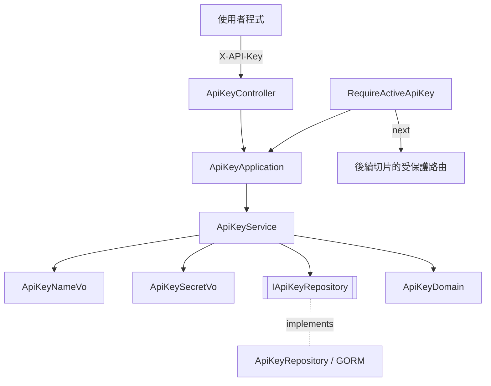

# API Key 管理 — Architecture Design

**Status:** Confirmed
**Source PRD:** `.sdd/2026-10-06-api-key-management/PRD.md`
**Tech context:** Go · Gin · GORM（PostgreSQL）· Clean / Onion Architecture（見 `.claude/rules/`）

---

## 1. Design Goal & Guiding Principle

- **In one sentence:** 提供申請 / 查詢狀態 / 撤銷 API key 三個公開能力，以及一個可掛在任何受保護路由前的 API key 驗證關卡；系統只保存 API key 的雜湊。
- **Guiding principle:** **「這把 API key 能不能用」的判斷只住在 `ApiKeyDomain` 一處。** 驗證關卡、查詢狀態、撤銷都透過它決定結果；之後加「到期時間」「用量上限」只改這個 Domain Model，不碰呼叫端。

另外，本切片是專案第一個切片，一併建立服務骨架（組裝根、設定讀取、資料庫連線、健康檢查）。

---

## 2. Change Scope

| Area | Action | What / Why |
| :--- | :--- | :--- |
| `cmd/server/` | **Add** | `main.go` 入口、`config.go` 讀環境變數、`dependencies.go` 手動 DI + `AutoMigrate` + 路由註冊 |
| `internal/domain/` | **Add** | API key 的 entity / domain model / VO / DTO、`ApiKeyService`、`IApiKeyRepository` |
| `internal/application/` | **Add** | `ApiKeyApplication` |
| `internal/controller/` | **Add** | `ApiKeyController`（三個端點 + 驗證關卡）、`HealthController` |
| `internal/infrastructure/persistence/` | **Add** | `ApiKeyRepository`（GORM）、資料庫連線建立 |
| Administrator 啟用介面 | **Not touched** | PRD 明訂直接改資料庫 |
| 申請頻率限制 | **Not touched** | PRD Out of Scope；風險已記錄 |
| 受保護的業務路由 | **Not touched** | 本切片尚無受保護功能；驗證關卡由後續切片掛上 |

---

## 3. New Classes / Modules

| Name | Kind | Responsibility (purpose) | Collaborators | Satisfies (PRD scenario) |
| :--- | :--- | :--- | :--- | :--- |
| `ApiKey` | Entity（`models/entities/`） | 持久化欄位：`ID`、`Name`、`SecretHash`（unique index）、`IsActive`（預設 false）、`RevokedAt *time.Time`、`CreatedAt`；`ToDomain()` | — | US-01~05 |
| `ApiKeyDomain` | Domain Model（`models/domains/`） | 判斷 API key 可否使用：`Authorize()`（已撤銷 → 無效、停用 → 尚未啟用）、`Revoke(now)`（已撤銷 → 無效）、`ToStatusDto()`、`ToAuthorizedDto()`、`ToEntity()` | `ApiKey` | US-03、US-04、US-05 |
| `ApiKeyNameVo` | VO | 名稱正規化與驗證：去前後空白、必填、≤100 字（以字元數計） | — | US-01 名稱相關 scenarios |
| `ApiKeySecretVo` | VO | 完整 API key：`GenerateApiKeySecretVo()` 產生（`snh_` + 32 bytes `crypto/rand` base64url）、`NewApiKeySecretVo(presented)`（空字串 → 需要提供）、`Hash()`（SHA-256 hex） | — | US-01、US-02、未提供 API key scenarios |
| `IssueApiKeyDto` / `IssuedApiKeyDto` / `ApiKeyStatusDto` / `AuthorizedApiKeyDto` | DTO | 申請輸入；申請結果（含完整 API key，唯一一次）；狀態（只有名稱與狀態）；驗證通過的 API key 識別 | — | US-01、US-02、US-03、US-05 |
| `IApiKeyRepository` | Interface | `Create`、`FindBySecretHash`（找不到回 `nil, nil`）、`UpdateRevokedAt` | — | 全部 |
| `ApiKeyService` | Domain Service | `IssueApiKey`、`GetApiKeyStatus`、`RevokeApiKey`、`AuthorizeApiKey`；查找 + 交給 `ApiKeyDomain` 判斷 + 轉 DTO；定義哨兵錯誤 | `IApiKeyRepository`、`ApiKeyDomain`、VO | 全部 |
| `ApiKeyApplication` | Application | 用例入口，轉呼叫 `ApiKeyService` | `ApiKeyService` | 全部 |
| `ApiKeyController` | Controller | `POST /api-keys`、`GET /api-keys/me`、`DELETE /api-keys/me`；`RequireActiveApiKey()` 回傳可掛在任何路由前的關卡（通過後把 API key ID 放進 request context）；錯誤 → HTTP 狀態對映 | `ApiKeyApplication` | 全部 |
| `ApiKeyRepository` | Repository | GORM 實作 `IApiKeyRepository` | `*gorm.DB` | 全部 |

### 介面細節

- **出示 API key：** request header `X-API-Key`。
- **申請：** body `{"name": "..."}` → `201 {"id", "name", "apiKey", "status": "inactive"}`。
- **查詢狀態：** `200 {"name", "status": "inactive" | "active"}`（不含完整 API key）。
- **撤銷：** `204`。
- **錯誤格式：** `{"error": {"code", "message"}}`，message 使用 PRD 文字。

| 哨兵錯誤（`service` 套件） | HTTP | code | message |
| :--- | :--- | :--- | :--- |
| `ErrApiKeyNameRequired` | 400 | `api_key_name_required` | API key 名稱為必填 |
| `ErrApiKeyNameTooLong` | 400 | `api_key_name_too_long` | API key 名稱不可超過 100 個字 |
| `ErrApiKeyMissing` | 401 | `api_key_missing` | 需要提供 API key |
| `ErrApiKeyInvalid`（不存在 / 已撤銷） | 401 | `api_key_invalid` | API key 無效 |
| `ErrApiKeyInactive` | 403 | `api_key_inactive` | API key 尚未啟用 |
| 其他（資料存取失敗） | 503 | `service_unavailable` | 服務暫時無法使用 |

VO / Domain Model 定義各自的錯誤，`service` 套件以同名變數重新匯出，controller 只 import `service`（符合「controller 只認 domain service 哨兵錯誤」）。

---

## 4. Modified Components

無（第一個切片）。

---

## 5. Component Relationships

---

## 6. Extensibility & Handoff Notes

- **Most likely next requirement:** 受保護功能（新聞搜尋、分析）掛上關卡；分析事件記錄是哪把 API key 觸發；API key 到期時間或用量上限。
- **Where it lands:**
  - 掛關卡：路由群組 `group.Use(apiKeyController.RequireActiveApiKey())`，handler 從 context 取 API key ID。
  - 到期 / 上限：`ApiKeyDomain.Authorize()` 加判斷 + 新哨兵錯誤 + controller 對映一列。
- **How to add it:** 不需改 `RequireActiveApiKey` 或其他呼叫端。
- **Patterns applied & why:** Rich Domain Model（`ApiKeyDomain`）集中「可否使用」的判斷；VO 處理輸入正規化；Repository 介面隔離 GORM。
- **Do not hardcode:** 資料庫連線字串（`DATABASE_URL`）、服務 port（`SERVER_PORT`）。
- **Known debt / deferred:** 申請無頻率限制；administrator 只能直接改資料庫。

### 技術決策

- **雜湊採 SHA-256 而非 bcrypt：** API key 為 256-bit 隨機值，不需慢雜湊抗暴力破解；SHA-256 可直接以雜湊值做唯一索引查找。
- **撤銷只更新 `revoked_at` 欄位：** 不整筆覆寫，避免把 administrator 同時修改的 `is_active` 蓋回舊值。
- **測試：** Domain Model / VO 單元測試；Application 測試注入真實 `ApiKeyService`、mock `IApiKeyRepository`；Controller 以 `httptest` + 真實 application/service + mock repository 驗證狀態碼與訊息；Repository 以真實 PostgreSQL 測試（未設 `TEST_POSTGRES_DSN` 時 skip）。

---

## 7. Traceability

| PRD Scenario | Fulfilled by |
| :--- | :--- |
| US-01 以有效名稱申請成功 | `ApiKeyService.IssueApiKey` + `ApiKeySecretVo` + `ApiKeyController` 201 |
| US-01 名稱前後的空白會被去除 | `ApiKeyNameVo` |
| US-01 名稱剛好 100 個字 / 超過 100 個字 | `ApiKeyNameVo` + controller 400 |
| US-01 未提供名稱 / 只有空白 | `ApiKeyNameVo` + controller 400 |
| US-01 名稱可重複 | `ApiKey` 名稱無唯一限制；每次產生新 `ApiKeySecretVo` |
| US-02 申請當下看得到完整 API key | `IssuedApiKeyDto` |
| US-02 之後查詢看不到完整 API key | `ApiKeyStatusDto`（無 API key 欄位）+ 只存 `SecretHash` |
| US-03 停用中 / 已啟用 | `ApiKeyDomain.ToStatusDto` |
| US-03 已撤銷 / 不存在 / 未提供 | `ApiKeyService.GetApiKeyStatus` + `ApiKeySecretVo` + controller 401 |
| US-04 撤銷已啟用 / 尚未啟用 | `ApiKeyDomain.Revoke` + `IApiKeyRepository.UpdateRevokedAt` |
| US-04 再次撤銷 / 不存在 | `ApiKeyDomain.Revoke` / `ApiKeyService.RevokeApiKey` → `ErrApiKeyInvalid` |
| US-04 撤銷後 administrator 重新啟用仍無效 | `ApiKeyDomain.Authorize`（撤銷優先於啟用） |
| US-05 五個關卡 scenarios | `ApiKeyController.RequireActiveApiKey` + `ApiKeyService.AuthorizeApiKey` + `ApiKeyDomain.Authorize` |

---

## 8. Risks & Open Decisions

- **Risks / trade-offs:** 申請端點無頻率限制；資料表名稱沿用 GORM 預設複數（`api_keys`）。
- **Open decisions (for implementation):** 無。
