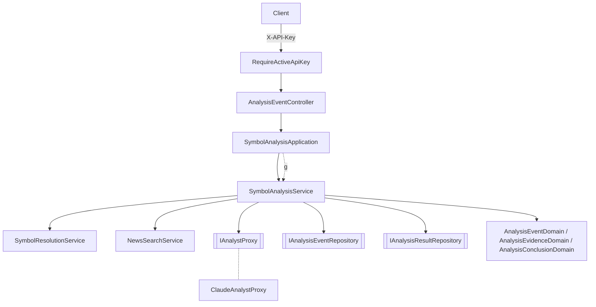

# 標的資訊面分析 — Architecture Design

**Status:** Confirmed
**Source PRD:** `.sdd/2026-10-06-symbol-news-analysis/PRD.md`
**Tech context:** Go · Gin · GORM（PostgreSQL）· Anthropic Go SDK（`anthropic-sdk-go`，Beta Messages API）· Clean / Onion Architecture

---

## 1. Design Goal & Guiding Principle

- **In one sentence:** `POST /analysis-events` 驗證並辨識標的後，重用或建立分析事件並立即回應；背景以「Domain 擁有的工具迴圈」驅動 AI：AI 每一輪要求搜尋新聞，domain 就呼叫既有的 `NewsSearchService` 並把結果交回 AI，直到 AI 提交結論；結論經 Domain Model 正規化後保存。`GET /analysis-events/:id` 查詢。
- **Guiding principle:** **AI 只是一個「會要求工具、最後交出結論」的 Proxy；分析規則全在 domain。** 5 輪上限、工具的語意、分析佐證蒐集、關鍵事件只能引用佐證、評等 / 信心 / 時間範圍正規化，全部是 domain 的程式碼並可在不呼叫 AI 的情況下測試。換 AI 供應商只需另寫一個 `IAnalystProxy` 實作；加新工具只改 domain 的工具分派與 Proxy 的工具定義。

---

## 2. Change Scope

| Area | Action | What / Why |
| :--- | :--- | :--- |
| `internal/domain/` | **Add** | 分析事件 / 分析結果 entity、Domain Model、VO、DTO、`SymbolAnalysisService`、`IAnalystProxy`、兩個 repository 介面 |
| `internal/application/` | **Add** | `SymbolAnalysisApplication`（發起後以 goroutine 執行分析；啟動時中斷殘留分析） |
| `internal/controller/` | **Add** | `AnalysisEventController` |
| `internal/infrastructure/anthropic/` | **Add** | `ClaudeAnalystProxy`（Anthropic Beta Messages API） |
| `internal/infrastructure/persistence/` | **Add** | `AnalysisEventRepository`、`AnalysisResultRepository` |
| `cmd/server/` | **Modify** | 新環境變數、AutoMigrate 兩張表、組裝、啟動時中斷殘留分析、掛路由於 API key 關卡後 |
| `NewsSearchService` / `SymbolResolutionService` | **Not touched** | 直接重用（AI 的搜尋工具 = `NewsSearchService.SearchSymbolNews`） |
| 價格 / 回測 | **Not touched** | 下一切片 |

---

## 3. New Classes / Modules

| Name | Kind | Responsibility (purpose) | Collaborators | Satisfies |
| :--- | :--- | :--- | :--- | :--- |
| `AnalysisEvent` | Entity | `ID`、`ApiKeyID`、`Symbol`、`Category`、`Status`、`FailureReason`、`Model`、`InputTokens`、`OutputTokens`、`StartedAt`、`FinishedAt *time.Time`；partial unique index：同 `symbol + category` 只能有一筆 `running` | — | US-01~05 |
| `AnalysisResult` | Entity | `ID`、`AnalysisEventID`（unique）、`Symbol`、`Category`、`Grade`、`Confidence`、`TimeHorizon`、`Reason`、`KeyEvents`、`RiskFactors`、`Evidence`（後三者 jsonb）、`CreatedAt` | `AnalysisKeyEvent`、`AnalysisEvidence`（entity 內的 json 結構） | US-03、US-04 |
| `AnalysisEventDomain` | Domain Model | `IsReusableAt(now)`（分析中，或 6 小時內完成）、`Succeed(finishedAt, usage)`、`Fail(reason, finishedAt, usage)`、`ToDto(result)`、`ToEntity()` | `AnalysisEvent` | US-02、US-03、US-05 |
| `AnalysisEvidenceDomain` | Domain Model | 蒐集這次 AI 取得的新聞（以連結去重）；`Record(symbolNews)`、`FindByLink(link)`、`IsEmpty()`、`ToEntities()` | `NewsDto` | US-04 佐證、關鍵事件 |
| `AnalysisConclusionDomain` | Domain Model | 建構子正規化 AI 原始結論：評等 / 時間範圍非法 → 安全預設、信心夾到 0–100、關鍵事件只留佐證中的連結（最多 5）、風險因子去空白（最多 5）、佐證為空 → 中性 + 0、理由空白 → `ErrAnalysisIncomplete`；`ToResultEntity(...)` | `AnalysisEvidenceDomain` | US-04 全部、US-05 未提供理由 |
| `AnalystRequestVo` | VO | 給 AI 的分析題目：標的、市場類別、搜尋字（公司簡稱 / 幣種名稱） | — | — |
| `AnalystExchangeVo` / `AnalystToolResultVo` | VO | 已發生的一輪：AI 回覆（Proxy 產生、domain 不解讀的不透明字串）+ domain 回給 AI 的工具結果 | — | 工具迴圈 |
| `AnalystTurnVo` / `AnalystNewsSearchVo` / `RawAnalysisConclusionVo` / `AnalystUsageVo` | VO | AI 這一輪的回應：要搜尋的標的清單，或原始結論，或拒絕；以及這一輪的用量 | — | 工具迴圈 |
| `IAnalystProxy` | Interface | `Respond(ctx, request, exchanges) (AnalystTurnVo, error)`：給定題目與已發生的所有輪次，回傳 AI 的下一輪；AI 服務錯誤 → error | — | 全部 |
| `IAnalysisEventRepository` | Interface | `Create`（同標的已有分析中 → `ErrAnalysisAlreadyRunning`）、`FindByID`、`FindLatestReusable(symbol, category)`、`Update`、`FailAllRunning(reason, finishedAt)` | — | US-01、02、03、05 |
| `IAnalysisResultRepository` | Interface | `Create`、`FindByAnalysisEventID` | — | US-03、04 |
| `SymbolAnalysisService` | Domain Service | `StartSymbolAnalysis(ctx, apiKeyID, dto)`：驗證、辨識、重用或建立；`AnalyzeSymbol(ctx, analysisEventID)`：工具迴圈（最多 5 輪）+ 正規化 + 保存，失敗記原因；`GetAnalysisEvent(ctx, id)`；`FailInterruptedAnalysisEvents(ctx)` | 上述介面、`SymbolResolutionService`、`NewsSearchService`、`IClockProxy` | 全部 |
| `SymbolAnalysisApplication` | Application | `StartSymbolAnalysis`：呼叫 service，新建立時以 `go` 背景執行 `AnalyzeSymbol`（脫離 request 取消）；`GetAnalysisEvent`；`FailInterruptedAnalysisEvents` | `SymbolAnalysisService` | 全部 |
| `AnalysisEventController` | Controller | `POST /analysis-events`（body `symbol`、`category`；新建 202、重用 200）；`GET /analysis-events/:id` | Application、`ErrorResponseTable` | 全部 |
| `ClaudeAnalystProxy` | Proxy | Beta Messages API：system prompt + 兩個 strict 工具（`search_symbol_news`、`submit_analysis`），以 `exchanges` 重建對話（AI 回覆以原始 JSON 還原後 `.ToParam()`，保留 thinking 區塊）；`tool_choice` auto（Opus 5.5 不支援強制）；`fallbacks: "default"`（refusal 時由伺服器改用其他模型）；`stop_reason == refusal` → 拒絕 | Anthropic SDK client | 全部 |
| `AnalysisEventRepository` / `AnalysisResultRepository` | Repository | GORM 實作；`TranslateError` 把唯一索引衝突轉成 `ErrAnalysisAlreadyRunning` | `*gorm.DB` | 全部 |

### 工具迴圈（`AnalyzeSymbol`）

```
for round in 1..5:
    turn = analystProxy.Respond(ctx, request, exchanges)      // error → 失敗「AI 服務暫時無法使用」
    usage += turn.Usage
    if turn.IsRefused        → 失敗「AI 拒絕分析此標的」
    if turn.Conclusion != nil → 正規化（理由空白 → 失敗「AI 未提供完整分析」）→ 保存 → 完成
    toolResults = for each search in turn.NewsSearches:
        NewsSearchService.SearchSymbolNews → evidence.Record → 結果 JSON
        標的找不到 / 新聞來源都失敗 / 參數錯誤 → is_error 結果，AI 繼續
    exchanges += {turn.Reply, toolResults}
失敗「AI 未在限制內完成分析」
```

AI 回覆沒有工具呼叫也沒有結論（純文字結束）→ 視為 AI 未提供完整分析。

### API

| Method | Path | 成功 | 備註 |
| :--- | :--- | :--- | :--- |
| `POST` | `/analysis-events` | 新建 `202`、重用 `200`，body 皆為 `AnalysisEventDto` | 關卡後；記錄 API key ID |
| `GET` | `/analysis-events/:id` | `200 AnalysisEventDto` | 非正整數 id 視同不存在 |

`AnalysisEventDto`：`analysisEventId`、`symbol`、`category`、`status`（`running`/`succeeded`/`failed`）、`failureReason`（可省略）、`startedAt`、`finishedAt`（可省略）、`result`（僅 `succeeded`）。
`AnalysisResultDto`：`analysisEventId`、`symbol`、`category`、`grade`、`confidence`、`timeHorizon`、`reason`、`keyEvents[{title, link, publishedAt}]`、`riskFactors[]`、`evidence[{title, link, publishedAt, providerName}]`、`createdAt`。

| 哨兵錯誤 | HTTP | code | message |
| :--- | :--- | :--- | :--- |
| 沿用 `ErrMarketCategoryUnsupported` / `ErrSymbolRequired` / `ErrSymbolNotFound` / `ErrNewsProvidersUnavailable` | 400 / 400 / 404 / 502 | 同新聞搜尋 | 同新聞搜尋 |
| `ErrAnalysisEventNotFound` | 404 | `analysis_event_not_found` | 找不到此分析事件 |
| 其他（資料存取失敗） | 503 | `service_unavailable` | 服務暫時無法使用 |

### 設定（環境變數）

| 變數 | 預設 | 用途 |
| :--- | :--- | :--- |
| `ANTHROPIC_API_KEY` | — | SDK 自動讀取 |
| `AI_ANALYSIS_MODEL` | `claude-opus-5-5` | 分析模型 |
| `AI_ANALYSIS_EFFORT` | `high` | 思考深度（`low`/`medium`/`high`/`xhigh`/`max`；Opus 5.5 預設為 medium，投資判斷屬高智力工作故設 high） |

---

## 4. Modified Components

| Component | Current role | Change needed |
| :--- | :--- | :--- |
| `cmd/server/config.go` | 讀 `DATABASE_URL`、`SERVER_PORT` | 加 `AI_ANALYSIS_MODEL`、`AI_ANALYSIS_EFFORT` |
| `cmd/server/dependencies.go` | 組裝 API key、新聞搜尋 | AutoMigrate 分析兩表；組裝分析；`main` 啟動時呼叫 `FailInterruptedAnalysisEvents`；掛 `/analysis-events` 路由 |

---

## 5. Component Relationships



---

## 6. Extensibility & Handoff Notes

- **Most likely next requirement:** 分析時價格（下一切片）；定時分析 watchlist；換 / 加 AI 供應商；給 AI 更多工具（價格、財報）。
- **Where it lands:**
  - 分析時價格：`AnalysisResult` 加欄位，`SymbolAnalysisService.AnalyzeSymbol` 保存前取價格。
  - 定時分析：新增 background job 呼叫 `SymbolAnalysisApplication.StartSymbolAnalysis`（重用規則自動生效）。
  - 換 AI：實作 `IAnalystProxy`，組裝根替換。
  - 新工具：`AnalystTurnVo` 加一種請求、domain 分派、Proxy 加工具定義。
- **Do not hardcode:** 模型、effort（環境變數）；5 輪、6 小時、5 則等業務常數放 Domain Model / Service 常數。
- **Known debt / deferred:** 背景分析為行程內 goroutine，服務重啟會中斷（以啟動時標記失敗處理）；保存分析結果後若更新分析事件失敗，該事件會停在分析中直到下次啟動被標記失敗。

---

## 7. Traceability

| PRD Scenario | Fulfilled by |
| :--- | :--- |
| US-01 發起成功 / 參數錯誤 / 找不到標的 / 停用 key | `SymbolAnalysisService.StartSymbolAnalysis` + `SymbolResolutionService.ResolveSymbol(ctx, rawSymbol, rawCategory)` + `RequireActiveApiKey` + controller |
| US-02 五個重用 scenarios | `AnalysisEventDomain.IsReusableAt` + `IAnalysisEventRepository.FindLatestReusable` + running 唯一索引 |
| US-03 五個查詢 scenarios | `SymbolAnalysisService.GetAnalysisEvent` + `AnalysisEventDomain.ToDto` + controller 404 |
| US-04 八個正規化 scenarios | `AnalysisConclusionDomain` + `AnalysisEvidenceDomain` |
| US-05 理由空白 / AI 無法使用 / 超過輪數 / 拒絕 | `SymbolAnalysisService.AnalyzeSymbol` 工具迴圈 + `ClaudeAnalystProxy` |
| US-05 服務重啟 | `FailInterruptedAnalysisEvents` + `IAnalysisEventRepository.FailAllRunning`，由 `main` 啟動時呼叫 |

---

## 8. Risks & Open Decisions

- **Risks / trade-offs:** 無 Anthropic 憑證時無法做真實 AI 冒煙測試，Proxy 以假伺服器驗證請求 / 回應格式。
- **Open decisions (for implementation):** 無。
