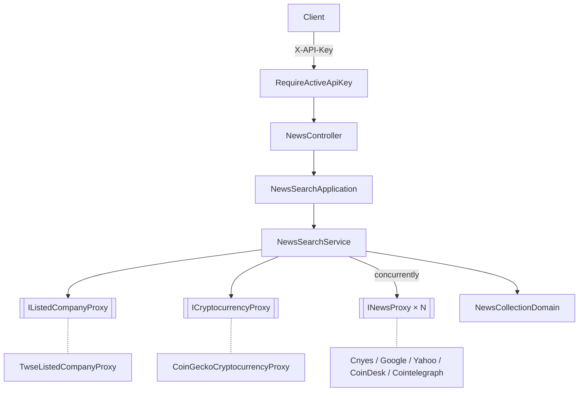

# 標的新聞搜尋 — Architecture Design

**Status:** Confirmed
**Source PRD:** `.sdd/2026-10-06-symbol-news-search/PRD.md`
**Tech context:** Go · Gin · Clean / Onion Architecture · 外部 HTTP（RSS / JSON）

---

## 1. Design Goal & Guiding Principle

- **In one sentence:** `GET /news?symbol=&category=`（掛 API key 關卡）依市場類別辨識標的、同時向該市場的新聞來源取新聞，交由 Domain Model 篩選 / 去重 / 排序 / 限量後回傳，部分來源失敗時列出失敗來源。
- **Guiding principle:** **「哪個市場用哪些新聞來源」是組裝根的一張表，「新聞清單怎麼整理」只住在 `NewsCollectionDomain`。** 新增 / 替換新聞來源只要實作 `INewsProxy` 並在組裝根加一列；調整時間窗、去重、數量規則只改 Domain Model。下一個切片的 AI 工具直接呼叫同一個 `NewsSearchApplication`。

---

## 2. Change Scope

| Area | Action | What / Why |
| :--- | :--- | :--- |
| `internal/domain/` | **Add** | 市場類別 / 標的 / 新聞 VO、`NewsCollectionDomain`、`NewsSearchService`、`INewsProxy` / `IListedCompanyProxy` / `ICryptocurrencyProxy` |
| `internal/application/` | **Add** | `NewsSearchApplication` |
| `internal/controller/` | **Add** | `NewsController`；`ErrorResponseTable`（共用錯誤對映） |
| `internal/controller/api_key_controller.go` | **Modify** | 改用 `ErrorResponseTable`，與 `NewsController` 共用錯誤回應機制 |
| `internal/infrastructure/news/` | **Add** | 五個新聞來源 Proxy（鉅亨網、Google 新聞、Yahoo 財經、CoinDesk、Cointelegraph） |
| `internal/infrastructure/twse/`、`internal/infrastructure/coingecko/` | **Add** | 標的辨識 Proxy（含 24 小時記憶體快取） |
| `internal/utilities/` | **Add** | `RssFeedParser`：RSS 2.0 解析（純技術轉換，不碰領域資料） |
| `cmd/server/` | **Modify** | 組裝新聞來源表、掛 `GET /news` 於 API key 關卡後 |
| 新聞保存 / 快取 | **Not touched** | PRD Out of Scope |

---

## 3. New Classes / Modules

| Name | Kind | Responsibility (purpose) | Collaborators | Satisfies (PRD scenario) |
| :--- | :--- | :--- | :--- | :--- |
| `MarketCategoryVo` | VO | 建構子驗證市場類別（`crypto` / `twStock` / `usStock`），其他 → `ErrMarketCategoryUnsupported` | — | US-02 市場類別 |
| `SymbolVo` | VO | 建構子去空白、空白 → `ErrSymbolRequired`；加密貨幣與美股轉大寫 | `MarketCategoryVo` | US-02 標的 |
| `ResolvedSymbolVo` | VO | 標的辨識結果：搜尋字 + 關聯字（加密貨幣為 [幣種名稱, 代號]）；三個市場各一個建構子 | — | US-03 |
| `NewsVo` | VO | 正規化後的單則新聞：標題、連結、發布時間、新聞來源名稱、摘要 | — | US-04 每則新聞包含完整資訊 |
| `NewsProviderVo` | VO | 一個新聞來源在某市場的設定：`INewsProxy` + 是否需要依關聯字篩選 | `INewsProxy` | US-03 |
| `NewsCollectionDomain` | Domain Model | `KeepMentioning(terms)`（不分大小寫比對標題或摘要）、`Merge`、`Curate(now)`（7 天內 → 由新到舊（穩定排序）→ 標題去重保留較新 → 最多 30）、`ToDtos()` | `NewsVo` | US-03 篩選、US-04 全部 |
| `INewsProxy` | Interface | `ProviderName() string`、`FetchNews(searchKeyword string) ([]vo.NewsVo, error)` | — | US-03、US-05 |
| `IListedCompanyProxy` | Interface | `FindCompanyShortName(stockCode) (shortName, found, error)` | — | US-02 台股、US-03 台股 |
| `ICryptocurrencyProxy` | Interface | `FindCoinName(symbol) (coinName, found, error)`（同代號取市值排名最前） | — | US-02 加密貨幣、US-03 加密貨幣 |
| `NewsSearchService` | Domain Service | `SearchSymbolNews(dto.SearchSymbolNewsDto)`：驗證 → 辨識 → 以 goroutine 同時呼叫該市場所有新聞來源 → 收集成功結果與失敗來源 → 全失敗 → `ErrNewsProvidersUnavailable` → `NewsCollectionDomain` 整理 → DTO | 上述介面、`IClockProxy` | 全部 |
| `SearchSymbolNewsDto` / `SymbolNewsDto` / `NewsDto` | DTO | 搜尋輸入；搜尋結果（`symbol`、`category`、`news[]`、`failedNewsProviders[]`） | — | 全部 |
| `NewsSearchApplication` | Application | 用例入口 | `NewsSearchService` | 全部 |
| `NewsController` | Controller | `GET /news`（query `symbol`、`category`）；錯誤對映 | `NewsSearchApplication`、`ErrorResponseTable` | 全部 |
| `ErrorResponseTable` | Controller 輔助型別 | 「哨兵錯誤 → 狀態碼 / code」對照表，`Respond(context, err)`；未列出者 → 503 | — | 兩個 controller 共用 |
| `CnyesNewsProxy` | Proxy | 鉅亨網關鍵字搜尋 JSON → `NewsVo`（連結 `https://news.cnyes.com/news/id/{newsId}`，摘要反轉義 HTML 實體） | `http.Client` | US-03 台股 |
| `GoogleNewsProxy` | Proxy | Google 新聞 RSS 搜尋（`q={keyword} when:7d`，語系由建構參數決定：繁中 / 英文） | `RssFeedParser` | US-03 |
| `YahooFinanceNewsProxy` | Proxy | Yahoo 財經個股 RSS | `RssFeedParser` | US-03 美股 |
| `CoinDeskNewsProxy` / `CointelegraphNewsProxy` | Proxy | 整體 RSS（忽略搜尋字，由 Domain 篩選） | `RssFeedParser` | US-03 加密貨幣 |
| `TwseListedCompanyProxy` | Proxy | 證交所上市公司開放資料（公司代號 → 公司簡稱），整份清單快取 24 小時 | `IClockProxy` | US-02、US-03 台股 |
| `CoinGeckoCryptocurrencyProxy` | Proxy | CoinGecko 搜尋，代號完全相符（不分大小寫）中取市值排名最前；結果（含查無）依代號快取 24 小時 | `IClockProxy` | US-02、US-03 加密貨幣 |
| `RssFeedParser` | Utility（`internal/utilities/`） | RSS 2.0 → `RssItem`（標題、連結、發布時間、描述）；無法解析的發布時間該則略過 | — | Edge cases |

### 介面細節

- **請求：** `GET /news?symbol=BTC&category=crypto`，header `X-API-Key`。
- **回應：** `200 {"symbol":"BTC","category":"crypto","news":[{"title","link","publishedAt","providerName","summary"}],"failedNewsProviders":["Google 新聞"]}`；`news`、`failedNewsProviders` 一律為陣列（可為空）。

| 哨兵錯誤 | HTTP | code | message |
| :--- | :--- | :--- | :--- |
| `ErrMarketCategoryUnsupported` | 400 | `market_category_unsupported` | 市場類別只能是 crypto、twStock、usStock |
| `ErrSymbolRequired` | 400 | `symbol_required` | 標的為必填 |
| `ErrSymbolNotFound` | 404 | `symbol_not_found` | 找不到此標的 |
| `ErrNewsProvidersUnavailable`（含標的辨識資料取不到） | 502 | `news_providers_unavailable` | 新聞來源暫時無法使用 |

### 新聞來源表（組裝根）

| 市場類別 | 新聞來源（`NewsProviderVo`） | 依關聯字篩選 |
| :--- | :--- | :--- |
| `twStock` | `CnyesNewsProxy`、`GoogleNewsProxy`（zh-TW） | 否 |
| `usStock` | `YahooFinanceNewsProxy`、`GoogleNewsProxy`（en-US） | 否 |
| `crypto` | `CoinDeskNewsProxy`、`CointelegraphNewsProxy` | 是 |
| `crypto` | `GoogleNewsProxy`（en-US） | 否 |

所有外部 HTTP 呼叫共用 `http.Client{Timeout: 10s}`；非 2xx 或格式無法解析 → 該來源失敗。

---

## 4. Modified Components

| Component | Current role | Change needed |
| :--- | :--- | :--- |
| `ApiKeyController` | API key 端點 + 關卡，自有錯誤對照迴圈 | 改用共用 `ErrorResponseTable` |
| `cmd/server/dependencies.go` | 組裝 API key | 加入新聞來源表、`NewsController`、`GET /news` 掛 `RequireActiveApiKey()` |

---

## 5. Component Relationships

---

## 6. Extensibility & Handoff Notes

- **Most likely next requirement:** AI 分析時以工具呼叫搜尋新聞；新增 / 替換新聞來源（例如官方 API 取代 Google 新聞）；支援上櫃股票。
- **Where it lands:**
  - AI 工具：直接呼叫 `NewsSearchApplication.SearchSymbolNews`，回傳的 DTO 即工具結果。
  - 新聞來源：實作 `INewsProxy`，在組裝根的新聞來源表加一列。
  - 上櫃股票：新增一個 `IListedCompanyProxy` 實作（或讓 TWSE 實作合併上櫃清單），`NewsSearchService` 不變。
- **Patterns applied & why:** Strategy（`INewsProxy` 多實作）處理「來源會換」這個變動軸；Rich Domain Model 集中整理規則。
- **Do not hardcode:** 新聞來源與市場的對應只在組裝根；7 天 / 30 則為 `NewsCollectionDomain` 常數。
- **Known debt / deferred:** 標的辨識快取為單機記憶體；多實例部署時各自快取（可接受）。

---

## 7. Traceability

| PRD Scenario | Fulfilled by |
| :--- | :--- |
| US-01 三個 scenarios | `RequireActiveApiKey`（切片 1）掛在 `GET /news` |
| US-02 市場類別兩個 scenarios | `MarketCategoryVo` + `NewsController` 400 |
| US-02 未提供標的 | `SymbolVo` + 400 |
| US-02 去空白轉大寫 | `SymbolVo` |
| US-02 台股 / 加密貨幣找不到 | `NewsSearchService` + `IListedCompanyProxy` / `ICryptocurrencyProxy` → 404 |
| US-02 美股查無新聞 | `NewsSearchService`（美股不辨識）+ 空陣列 |
| US-03 三個 scenarios | 新聞來源表 + `ResolvedSymbolVo` + `NewsCollectionDomain.KeepMentioning` |
| US-04 五個 scenarios | `NewsCollectionDomain.Curate` + `NewsVo` / `NewsDto` |
| US-05 單一來源失敗 | `NewsSearchService`（收集失敗來源）+ `failedNewsProviders` |
| US-05 全部失敗 / 辨識資料取不到 | `NewsSearchService` → `ErrNewsProvidersUnavailable` → 502 |

---

## 8. Risks & Open Decisions

- **Risks / trade-offs:** 外部來源格式變動會讓該來源失敗（不影響其他來源）；Google 新聞條款風險（見 PRD）。
- **Open decisions (for implementation):** 無。
