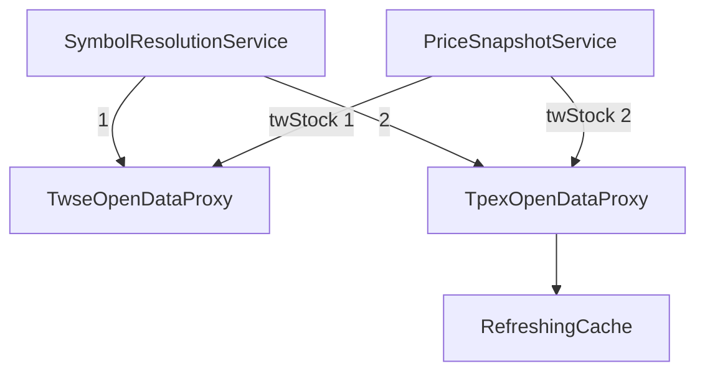

# 上櫃股票支援 — Architecture Design

**Status:** Confirmed
**Source PRD:** `.sdd/2026-10-07-otc-stock-support/PRD.md`
**Tech context:** Go · Clean / Onion Architecture · 既有 `IListedCompanyProxy` / `IPriceProxy` / `RefreshingCache`

---

## 1. Design Goal & Guiding Principle

- **In one sentence:** 新增 `TpexOpenDataProxy`（同時實作 `IListedCompanyProxy` 與 `IPriceProxy`），並讓台股的標的辨識與取價都改為「依序詢問多個來源，第一個有答案者為準」。
- **Guiding principle:** **「依序詢問、先有答案者為準、無法確定時不亂下結論」是 domain 規則，只寫一次。** `SymbolResolutionService` 對台股來源清單、`PriceSnapshotService` 對每個市場的價格來源清單都採同一語意；加興櫃或換來源只需在組裝根的清單加一項。

---

## 2. Change Scope

| Area | Action | What / Why |
| :--- | :--- | :--- |
| `internal/infrastructure/tpex/` | **Add** | `TpexOpenDataProxy`：櫃買中心上櫃股票每日收盤行情（1 小時 `RefreshingCache`），提供公司簡稱與收盤價 |
| `SymbolResolutionService` | **Modify** | 台股改為依序查詢 `[]IListedCompanyProxy`；建構參數改為 `dto.SymbolDirectoryCatalogDto` |
| `PriceProviderCatalogDto` / `PriceSnapshotService` | **Modify** | 各市場改為 `[]IPriceProxy`，依序取第一個成功的報價 |
| `cmd/server/dependencies.go` | **Modify** | 台股辨識與取價清單為「證交所 → 櫃買中心」；新增櫃買中心網址 |
| 新聞來源 | **Not touched** | 以公司簡稱搜尋，不需改變 |
| 美股 / 加密貨幣 | **Not touched** | 清單各只有一個來源，行為不變 |

---

## 3. New Classes / Modules

| Name | Kind | Responsibility (purpose) | Collaborators | Satisfies |
| :--- | :--- | :--- | :--- | :--- |
| `TpexOpenDataProxy` | Proxy（`internal/infrastructure/tpex/`） | `GET https://www.tpex.org.tw/openapi/v1/tpex_mainboard_daily_close_quotes`（約 5 MB），以 `SecuritiesCompanyCode` 建索引；`FindCompanyShortName` 回 `CompanyName`；`FetchPrice` 回 `Close`（民國日期 `Date` 轉台北時間當日 00:00、TWD、來源「櫃買中心」），收盤價非數字（如 `---`）→ error；空資料 → error | `HttpBodyReader`、`RefreshingCache`、`IClockProxy` | US-01、US-02 |
| `SymbolDirectoryCatalogDto` | DTO（service 建構參數） | `TwStock []IListedCompanyProxy`（依序）、`Crypto ICryptocurrencyProxy` | — | US-01 |

民國日期轉換與 `twse` 套件相同；為避免兩個 infrastructure 套件互相依賴，抽到 `internal/utilities/` 的 `RepublicOfChinaDateParser`（純技術轉換）。

---

## 4. Modified Components

| Component | Current role | Change needed |
| :--- | :--- | :--- |
| `SymbolResolutionService.ResolveSymbol` | 台股只查一個清單 | 依序查詢：找到即回；全部「明確沒有」→ `ErrSymbolNotFound`；有任一來源錯誤且沒人找到 → `ErrNewsProvidersUnavailable` |
| `PriceSnapshotService.CapturePrice` | 每市場一個來源 | 依序取價，第一個成功者為準；全失敗 → `nil`；整體仍在 10 秒期限內 |
| `TwseOpenDataProxy` | 證交所 | 改用共用的 `RepublicOfChinaDateParser` |

---

## 5. Component Relationships

---

## 6. Extensibility & Handoff Notes

- **Most likely next requirement:** 興櫃股票；台股即時價。
- **Where it lands:** 實作 `IListedCompanyProxy` / `IPriceProxy` 並加到組裝根的台股清單。
- **Known debt / deferred:** 櫃買中心資料含 ETF 等證券，名稱為基金全名。

---

## 7. Traceability

| PRD Scenario | Fulfilled by |
| :--- | :--- |
| US-01 七個 scenarios | `SymbolResolutionService`（依序規則）+ `TpexOpenDataProxy.FindCompanyShortName` + 組裝根清單順序 |
| US-02 三個 scenarios | `PriceSnapshotService`（依序取價）+ `TpexOpenDataProxy.FetchPrice` |

---

## 8. Risks & Open Decisions

- **Risks:** 每小時下載約 5 MB；在 10 MB 讀取上限內。
- **Open decisions:** 無。
