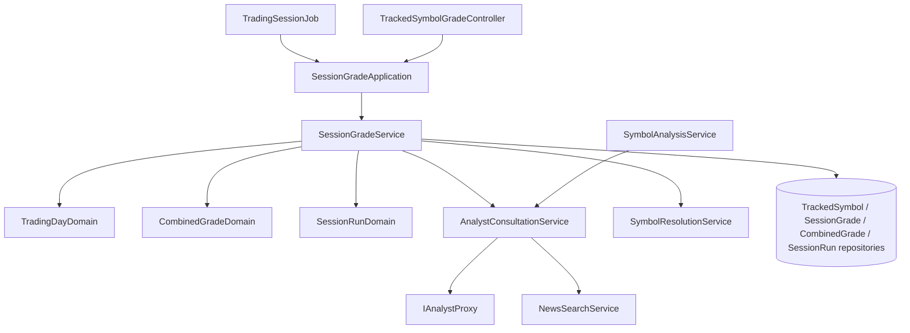

# 追蹤標的時段評等 — Architecture Design

**Status:** Confirmed
**Source PRD:** `.sdd/2026-10-07-tracked-symbol-session-grade/PRD.md`
**Tech context:** Go 1.26 · Gin · GORM（PostgreSQL）· Clean / Onion Architecture · 既有 `IAnalystProxy` 工具迴圈、`NewsSearchService`、`SymbolResolutionService`

---

## 1. Design Goal & Guiding Principle

- **In one sentence:** 新增一個每分鐘檢查一次的背景 job，在台北時間的盤前 / 盤中 / 盤後執行時段，對追蹤中的台股追蹤標的依序做「只看該時段新聞」的 AI 分析，存成時段評等並重算綜合評等；另提供查詢 API。
- **Guiding principle:** **「和 AI 來回到得出結論」只寫一次。** 把 `SymbolAnalysisService.AnalyzeSymbol` 內的 AI 工具迴圈抽成 `AnalystConsultationService.Consult`，使用者發起的分析與時段評等共用同一份迴圈；兩者的差異（存哪裡、要不要取價、新聞範圍）都在迴圈外。時間規則（哪天是交易日、現在該跑哪個時段、新聞從何時起）集中在 `TradingDayDomain` 一個地方。

---

## 2. Change Scope

| Area | Action | What / Why |
| :--- | :--- | :--- |
| `SymbolAnalysisService.AnalyzeSymbol` | **Modify** | AI 迴圈抽到 `AnalystConsultationService`；本方法只剩「讀事件 → 諮詢 → 取價 / 存結果 → 更新事件」。行為不變，既有測試即安全網 |
| `NewsSearchService` / `SearchSymbolNewsDto` / `NewsCollectionDomain.Curate` | **Modify** | 新增可選的 `PublishedSince`；`Curate` 以 `max(now−7 天, PublishedSince)` 過濾，**先過濾再取 30 則** |
| `AnalystRequestVo` / `ClaudeAnalystProxy` | **Modify** | 新增可選 `PublishedSince`；有值時在提示中告知 AI 只會拿到這之後的新聞 |
| `internal/domain/models/entities/` | **Add** | `TrackedSymbol`、`SessionGrade`、`CombinedGrade`、`SessionRun` |
| `internal/domain/models/domains/` | **Add** | `AnalystConsultationDomain`、`TradingDayDomain`、`CombinedGradeDomain`、`SessionRunDomain` |
| `internal/domain/models/vo/` | **Add** | `SessionWeightsVo` |
| `internal/domain/service/` | **Add** | `AnalystConsultationService`、`SessionGradeService`、`session_grade_errors.go` |
| `internal/domain/interface/` | **Add** | `ITrackedSymbolRepository`、`ISessionGradeRepository`、`ICombinedGradeRepository`、`ISessionRunRepository`、`IBackgroundJob` |
| `internal/infrastructure/persistence/` | **Add** | 四個對應 repository |
| `internal/application/` | **Add** | `SessionGradeApplication` |
| `internal/controller/` | **Add** | `TrackedSymbolGradeController`（`GET /tracked-symbol-grades`） |
| `internal/job/` | **Add** | `TradingSessionJob`、`BackgroundJobManager` |
| `cmd/server/` | **Modify** | AutoMigrate 新 entity、設定、DI、路由、啟動時中斷時段執行、啟動背景 job |
| 分析事件 / 分析結果 / 重用規則 / 同時分析上限 | **Not touched** | 自動分析不建立分析事件，PRD 明定互不影響 |
| 追蹤標的管理 API | **Not touched** | administrator 直接改資料（比照啟用 API key） |

---

## 3. New Classes / Modules

| Name | Kind | Responsibility (purpose) | Collaborators | Satisfies |
| :--- | :--- | :--- | :--- | :--- |
| `AnalystConsultationService.Consult(ctx, dto.ConsultAnalystDto) domains.AnalystConsultationDomain` | Domain Service | 與 AI 來回最多 5 輪：轉送新聞搜尋（帶 `PublishedSince`）、記錄佐證、累計用量、正規化結論；回傳結論或失敗原因 | `IAnalystProxy`、`NewsSearchService` | US-03 全部；既有分析行為 |
| `ConsultAnalystDto` | DTO | `Symbol`、`Category`、`SearchKeyword`、`PublishedSince time.Time`（零值＝不限） | — | US-03 |
| `AnalystConsultationDomain` | Domain Model | 一次諮詢的結果：`Conclusion() (AnalysisConclusionDomain, bool)`、`FailureReason()`、`Usage()`、`AnsweringModel()` | `AnalysisConclusionDomain` | US-06 |
| `TradingDayDomain` | Domain Model | 由 `now` 建立（轉 UTC+8）：`IsTradingDay()`、`Value()`（`2006-01-02`）、`DueSession() (string, bool)`、`NewsPublishedSince(session) time.Time`。執行時段與新聞起點以一張 session 定義表描述 | — | US-02 全部 |
| `SessionWeightsVo` | VO | 盤前 / 盤中 / 盤後權重；建構子把非正數換成預設 0.3 / 0.2 / 0.5 | — | 權重預設值 scenario |
| `CombinedGradeDomain` | Domain Model | 由當天的 `[]entities.SessionGrade` + `SessionWeightsVo` 建立：計算綜合分數、綜合評等、綜合信心指數；`ToEntity(...)`、`ToDto(sessionGrades)` | — | US-04 全部 |
| `SessionRunDomain` | Domain Model | 時段執行紀錄的狀態轉換：`RecordSymbolOutcome(bool)`、`Succeed(now)`、`Fail(reason, now)`、`ToEntity()` | — | US-01 空清單、US-06 |
| `SessionGradeService` | Domain Service | `RunDueTradingSession(ctx)`：判斷時段 → 建立執行紀錄（重複即略過）→ 盤前刪前一天 → 逐檔：辨識標的 → `Consult` → 存時段評等 → 重算綜合評等；`GetTrackedSymbolGrades(ctx, dto)`；`FailInterruptedSessionRuns(ctx)` | 四個 repository、`AnalystConsultationService`、`SymbolResolutionService`、`IClockProxy`、`SessionWeightsVo` | US-01、02、05、06、07 |
| `TrackedSymbol` / `SessionGrade` / `CombinedGrade` / `SessionRun` | Entity | 乾淨資料模型；唯一索引見 §6 | — | — |
| `I...Repository` ×4 + 實作 | Interface / Repository | 見下方介面 | GORM | — |
| `SessionGradeApplication` | Application | 包住 service；`RunDueTradingSession` recover panic 並 log | `SessionGradeService` | — |
| `TrackedSymbolGradeController` | Controller | 解析 `symbol`、`category` query，對映錯誤 | `SessionGradeApplication` | US-07 |
| `IBackgroundJob` / `TradingSessionJob` / `BackgroundJobManager` | Job | `TradingSessionJob` 以 `time.Ticker`（預設 60 秒）在單一 goroutine 呼叫 `RunDueTradingSession`；manager 只認 `[]IBackgroundJob` | `SessionGradeApplication` | US-02 |

**Repository 介面**

```go
ITrackedSymbolRepository  FindTracking(ctx, category string) ([]entities.TrackedSymbol, error)
ISessionGradeRepository   Save(ctx, *entities.SessionGrade) error                       // upsert on (symbol, category, trading_day, session)
                          FindByTradingDay(ctx, symbol, category, tradingDay string) ([]entities.SessionGrade, error)
                          FindByTradingDays(ctx, tradingDays []string) ([]entities.SessionGrade, error)
                          DeleteExceptTradingDay(ctx, tradingDay string) error
ICombinedGradeRepository  Save(ctx, *entities.CombinedGrade) error                      // upsert on (symbol, category, trading_day)
                          FindAll(ctx, symbol, category string) ([]entities.CombinedGrade, error) // 空字串＝不篩選；trading_day 新到舊
                          DeleteExceptTradingDay(ctx, tradingDay string) error
ISessionRunRepository     Create(ctx, *entities.SessionRun) error                        // 重複 → ErrSessionRunAlreadyExists
                          Update(ctx, *entities.SessionRun) error
                          FailAllRunning(ctx, failureReason string, finishedAt time.Time) error
```

---

## 4. Modified Components

| Component | Current role | Change needed |
| :--- | :--- | :--- |
| `SymbolAnalysisService` | 發起 / 執行 / 查詢分析 | 建構子改收 `*AnalystConsultationService`（取代 `newsSearchService`，`analystProxy` 仍用於 `ModelName()`）；`AnalyzeSymbol` 改呼叫 `Consult`，成功後取價、存結果（失敗 → 「分析結果保存失敗」） |
| `NewsCollectionDomain.Curate(now, publishedSince)` | 7 天內、去重、30 則 | 下限改為 `max(now−7 天, publishedSince)`，起點含 |
| `SearchSymbolNewsDto` | `Symbol`、`Category` | 加 `PublishedSince time.Time` |
| `AnalystRequestVo` / `ClaudeAnalystProxy.Respond` | 標的、市場類別、搜尋字 | 加 `PublishedSince`；非零值時提示加一句「只會取得 {RFC3339} 之後發布的新聞」 |
| `config.go` | 讀環境變數 | 新增 `BACKGROUND_JOBS_ENABLED`（預設 true）、`TRADING_SESSION_JOB_INTERVAL_SECONDS`（預設 60，≤0 停用）、`SESSION_WEIGHT_PRE_MARKET` / `SESSION_WEIGHT_INTRADAY` / `SESSION_WEIGHT_AFTER_MARKET`（解析失敗視為 0 → VO 用預設） |
| `dependencies.go` / `main.go` | DI、路由、啟動 | AutoMigrate 四個新 entity；組 `SessionGradeService` 等；`prepareRouter` 同時中斷時段執行；`main` 依總開關啟動 `BackgroundJobManager` |

---

## 5. Component Relationships



---

## 6. Extensibility & Handoff Notes

- **Most likely next requirement:** 美股（或加密貨幣）也要自動時段評等；或加國定假日。
- **Where it lands:** `TradingDayDomain` 的 session 定義表（執行時段、新聞起點）與「哪些日子是交易日」。`SessionGradeService` 只問「現在該跑哪個時段、新聞從何時起」，不知道台股時刻表。
- **How to add it:** 美股 → 讓 `TradingDayDomain` 依市場類別帶不同的定義表與時區，service 迴圈改為逐市場類別；假日 → 在 `TradingDayDomain.IsTradingDay` 加假日清單（可由新 proxy 提供）。皆不需動 AI 迴圈、評等計算或儲存。
- **Patterns applied & why:** 抽出 `AnalystConsultationService` 是把「兩個用例共用的 AI 工具迴圈」收成一個 deep module（一個方法、一個輸入 DTO、一個結果）；`CombinedGradeDomain` 把加權平均與分數 ↔ 評等對照封裝在一起，換公式只改一處。
- **Do not hardcode:** 時段權重（設定）；job 檢查間隔（設定）。
- **唯一索引：** `tracked_symbols (symbol, category)`；`session_grades (symbol, category, trading_day, session)`；`combined_grades (symbol, category, trading_day)`；`session_runs (trading_day, session)`——最後一個同時保證「同時段只執行一次」，多個服務實例也成立。
- **Known debt / deferred:** 時段評等與綜合評等的寫入不在同一個交易中（綜合評等寫入失敗 → 該檔計為失敗，下次時段會重算）；國定假日仍執行。

---

## 7. Traceability

| PRD Scenario | Fulfilled by |
| :--- | :--- |
| US-01 追蹤中的台股標的產生時段評等 | `SessionGradeService.RunDueTradingSession` + `ITrackedSymbolRepository.FindTracking("twStock")` |
| US-01 暫停的標的 / 非台股不分析 | `TrackedSymbolRepository.FindTracking`（`is_tracking = true` 且 category 篩選） |
| US-01 沒有可分析的標的仍完成執行 | `SessionRunDomain.Succeed`（0 / 0） |
| US-01 同一標的只能登記一次 | `tracked_symbols` 唯一索引 |
| US-02 各時段執行、新聞範圍、邊界、週末 | `TradingDayDomain.DueSession` / `NewsPublishedSince` |
| US-02 同時段只執行一次 | `session_runs` 唯一索引 → `ErrSessionRunAlreadyExists` → 略過 |
| US-02 錯過的時段不補跑 | `TradingDayDomain.DueSession`（只看當下時刻） |
| US-03 範圍外不採用 / 起點含 | `NewsCollectionDomain.Curate(now, publishedSince)` |
| US-03 範圍內沒有新聞為中性 | `AnalysisConclusionDomain`（佐證為空 → 中性、0） |
| US-03 不重用使用者發起的分析 | `SessionGradeService` 不經 `SymbolAnalysisService` |
| US-04 加權平均、缺時段、邊界、覆蓋 | `CombinedGradeDomain` + `ICombinedGradeRepository.Save`（upsert） |
| US-04 權重非正數用預設 | `SessionWeightsVo` 建構子 |
| US-05 盤前刪除 / 只有盤前刪除 | `SessionGradeService`（preMarket 才呼叫 `DeleteExceptTradingDay`） |
| US-05 週末查得到週五 | 查詢不篩交易日，只回現存資料 |
| US-06 一檔失敗其他照常 | `SessionGradeService` 逐檔迴圈 + `SessionRunDomain.RecordSymbolOutcome` |
| US-06 重啟中斷 | `SessionGradeService.FailInterruptedSessionRuns` |
| US-07 查詢全部 / 指定 / 空結果 | `SessionGradeService.GetTrackedSymbolGrades` |
| US-07 只給標的 → 拒絕 | `ErrSymbolAndCategoryRequiredTogether`（400 `symbol_and_category_required_together`） |
| US-07 不支援的市場類別 | `vo.NewMarketCategoryVo` → 400 `market_category_unsupported` |
| US-07 停用中 API key | 既有 `RequireActiveApiKey` middleware |

---

## 8. Risks & Open Decisions

- **Risks / trade-offs:** 依序分析，追蹤標的多時一個時段可能超過執行時段才結束——job 的 ticker 在執行中會丟掉 tick，不會重疊；下一個時段照常判斷。時區用固定 UTC+8（台灣無夏令時間），避免依賴系統 tzdata。
- **Open decisions (for implementation):** 無。查詢回應形狀：`[]TrackedSymbolGradeDto{symbol, category, tradingDay, grade, combinedScore, confidence, updatedAt, sessionGrades[]{session, grade, confidence, reason, keyEvents, riskFactors, createdAt}}`。
